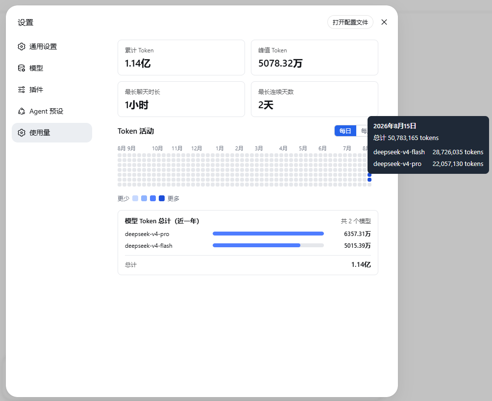

[中文](README.md) | **English**

# dsh-token-activity Token Consumption Heatmap Plugin

[](LICENSE)

> A **third-party plugin** for [DeepSeek Harness](https://github.com/deepseek-ai/deepseek-harness): displays a daily Token consumption heatmap for the last 365 days. Hover over any date to view all the models used that day and their Token usage.

---

## Plugin Features

- Adds a top-level "Usage" navigation item to the settings interface.
- Two metric cards at the top: cumulative Token and peak Token.
- A daily heatmap of the last 365 local calendar days, with month labels arranged continuously across years.
- Per-day tooltip: date, daily total, and all models used that day with their respective Token usage.
- Historical sessions are automatically backfilled, with real-time backfill progress; a failure in a single session does not affect the whole.

### Preview



---

## Installation

### Environment Requirements

- Node.js `>=24.0.0`
- pnpm `11.7.0`

If the terminal reports that the `dsh` command cannot be found, first install the DSH CLI globally:

```sh
npm install --global @deepseek-ai/dsh --registry=https://registry.npmjs.org/
```

### Install from npm

Install the npm package:

```sh
# Run as an administrator
dsh plugin --profile web add @snownightt/dsh-token-activity-bundle

# Restart DeepSeek Harness after installation.
dsh web
```


## Quick Start

1. After installing the plugin, start the DeepSeek Harness Web service:

   ```sh
   dsh web
   ```

2. Open the DeepSeek Harness Web interface in your browser.Open **Settings**, then select the top-level **Usage** navigation item.

3. When the page is opened for the first time, the plugin automatically backfills historical session data. Wait for the displayed backfill progress to finish. A failure while reading one session does not interrupt the remaining backfill.

4. When the backfill is complete, the page should display:

   - cumulative Token usage;
   - peak daily Token usage;
   - a Token usage heatmap covering the last 365 local calendar days;
   - a tooltip showing the daily total and per-model usage when you hover over a date.

### Verify the Installation

Run the following command to inspect the composed configuration:

```sh
dsh --profile web --dump-config
```

The output should contain both of the following plugin entries:

```text
token-activity
ui-token-activity
```

If both entries are present but **Settings → Usage** does not appear, restart the DeepSeek Harness Web service and refresh the browser page.

## Local Development

If you run DeepSeek Harness locally and have git-cloned this repository, it is recommended to place DeepSeek Harness and this project in the same parent directory.

First install and build the plugin:

```sh
pnpm install --frozen-lockfile
pnpm run test
pnpm run typecheck
pnpm run build
```

Then run the following in the DeepSeek Harness root directory:

```sh
pnpm dsh plugin --profile web add ../dsh-token-activity/packages/token-activity ../dsh-token-activity/packages/ui-token-activity ../dsh-token-activity/packages/token-activity-bundle
```

If DeepSeek Harness and this project are not in the same parent directory, adjust the paths in the install command above accordingly.

The locally developed add-on needs to be re-packaged and then the Deepseek Harness needs to be restarted.

## Uninstall

If installed from npm, run:

```sh
# It needs to be executed in the Deepseek Harness directory.
 pnpm dsh plugin --profile web remove @snownightt/dsh-token-activity @snownightt/dsh-token-activity-bundle @snownightt/dsh-ui-token-activity  

 # Can be executed in any directory
 dsh plugin --profile web remove @snownightt/dsh-token-activity @snownightt/dsh-token-activity-bundle @snownightt/dsh-ui-token-activity
```
Restart after uninstalling.


## Update
```sh
# Remove the old package first
dsh plugin --profile web remove @snownightt/dsh-token-activity-bundle

# Install the new package. Run as Administrator
dsh plugin --profile web add @snownightt/dsh-token-activity-bundle@0.1.2
```

---

## Known Limitations

This plugin derives Token usage from DeepSeek Harness **session logs**. It does not read an API provider's account billing records directly. Its cumulative value therefore means "Token usage recorded in Harness sessions," not provider-account usage. Always use the provider's official platform for charges, balances, and final billing.

In the current version, the following situations may cause the plugin's statistics values to be inconsistent with the actual values on the official platform.:

- Auxiliary model calls, such as automatic title generation and context compaction, may not be fully included in session-activity accounting.
- DeepSeek native web search makes additional model calls, but its response usage is not currently persisted to this plugin's data source.
- Failed, cancelled, or retried requests are counted only when Harness persisted their `usage` in the session log.
- The displayed result can be temporarily incomplete while historical backfill is failing.
- Calls made with the same API key by other applications, scripts, or services are outside the plugin's visibility.

For ordinary logged session model calls, the plugin counts `input + output + cache read + cache write`. Future releases will expand coverage of auxiliary calls, but provider-specific billing rules, cache behavior, and available usage APIs can still differ from the official account data.

